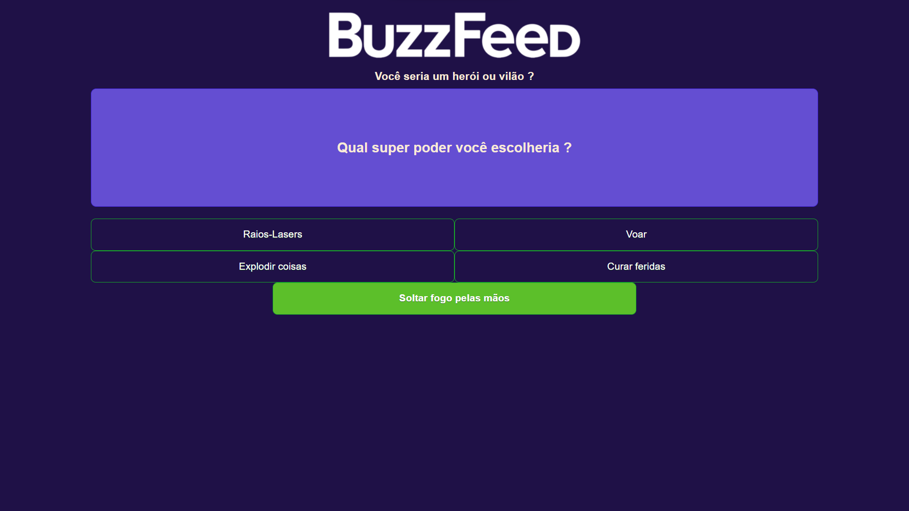

<h1 align="center"> Clone BuzzFeed </h1>

Projeto desenvolvido durante o bootcamp NTT DATA Diversidade em Tech da DIO

  <a href="#-tecnologias">Tecnologias</a>&nbsp;&nbsp;&nbsp;|&nbsp;&nbsp;&nbsp;
  <a href="#-projeto">Projeto</a>&nbsp;&nbsp;&nbsp;|&nbsp;&nbsp;&nbsp;
  <a href="#-layout">Layout</a>&nbsp;&nbsp;&nbsp;

 

  

## 🚀 Tecnologias

Esse projeto foi desenvolvido com as seguintes tecnologias:

- HTML e CSS
- JavaScript
- Git e GitHub
- TypeScript
- Angular

## 💻 Projeto

O projeto consiste em um teste de personalidade baseado no site BuzzFeed para descobrir se o usuário seria um Super Herói ou Vilão

---
